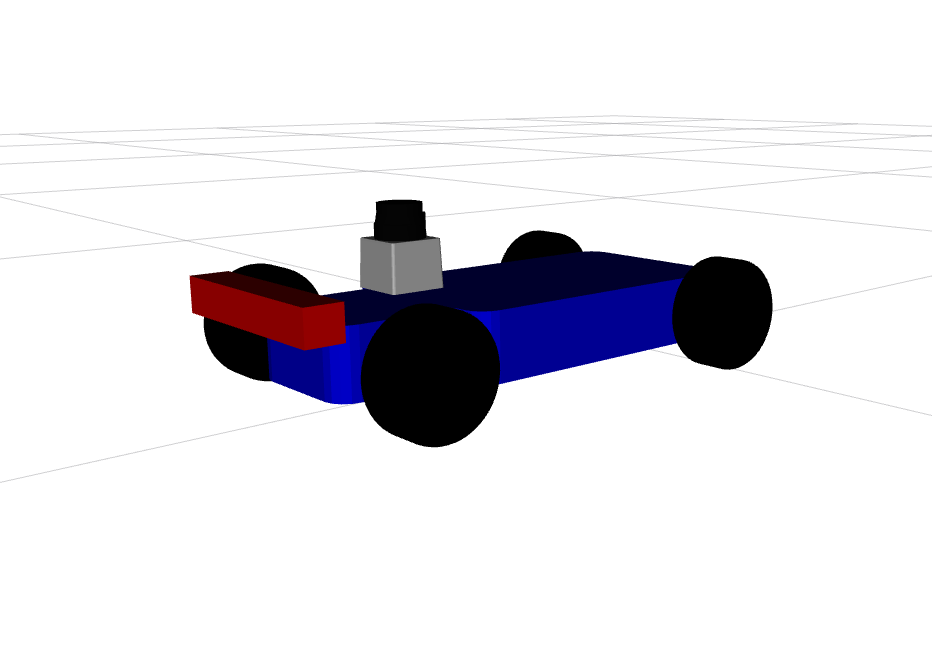

# maila_description

## Description
This package holds the urdf description of the robot.



## Launch Files

For launching robot state publisher for filling up static tf information and serving the description of the robot. Typically used during robot bringup.
```
ros2 launch maila_description maila_description.launch.py
```

For launching the robot state publisher and providing some visualization with rviz to analyze the robot description.
```
ros2 launch maila_description view_maila.launch.py
```


#### References:
 * https://github.com/mlab-upenn/racecar-simulator
 * https://github.com/Ekumen-OS/andino/blob/humble/andino_description


